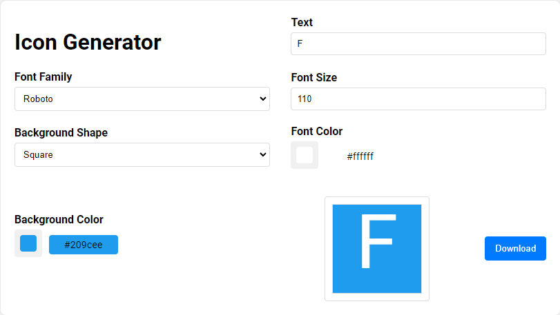

# icon-generator
 Text icon generator

 ## Demo
https://mariusmutu.github.io/icon-generator/

 ## Usage
To run the project locally, you need to have Node.js and pnpm installed. Then, run the following commands:
- npm install -g pnpm
This will install pnpm globally.

- pnpm install
This will install the dependencies.

- pnpm run dev
This will start a local server on http://localhost:5173/

Alternatively, you can copy the **index.html** and **src/script.js** on a local web server

